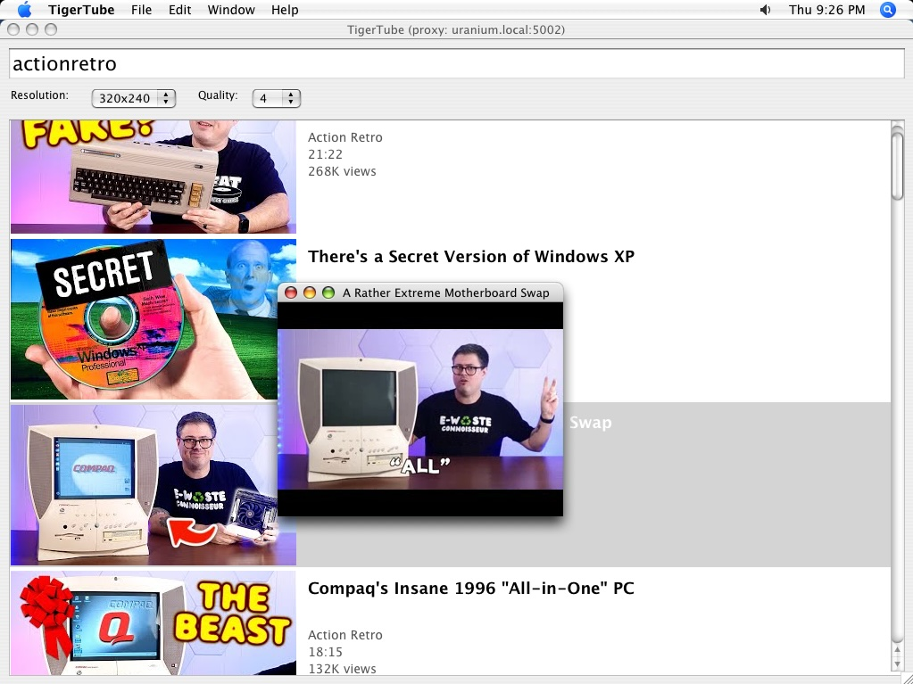

# TigerTube

A native Cocoa YouTube client for **Mac OS X 10.4 Tiger on PowerPC**,
paired with a transcoding proxy that runs on a modern host.



## How it works

TigerTube bundles a modern build of openssl
and interacts directly with YouTube's HTTPS REST API
for search results, video metadata, thumbnail images, etc.

When you click on a search result,
TigerTube makes a request to the transcoding proxy
(a Python script which you run on a modern, powerful host),
which transcodes the requested video in real-time
(MPEG-1 video / PCM audio) and serves that to TigerTube.

## Running the release build

Grab [TigerTube-0.2.zip](https://github.com/cellularmitosis/TigerTube/releases/tag/v0.2)
from the Releases page. It contains:

- `TigerTube.app` — PowerPC Release build, targets 10.4+
- `proxy/tigertube-proxy.py` — Python/Flask transcoding proxy

### 1. Start the proxy on a modern host

Requires Python 3, `ffmpeg`, `yt-dlp`, `flask`, and `python-zeroconf`:

```sh
pip install flask yt-dlp zeroconf
python3 proxy/tigertube-proxy.py
```

The proxy listens on port `5002` and advertises itself via mDNS.

### 2. Launch TigerTube.app on the Tiger Mac

TigerTube will auto-discover the proxy on a healthy LAN — no configuration needed.
The window title shows which proxy it found (e.g. `uranium.local:5002`).

## Player controls

| Key         | Action                  |
|-------------|-------------------------|
| `f`         | Toggle fullscreen       |
| `ESC`       | Exit fullscreen / close |
| `q`         | Quit player             |
| `←` / `→`   | Seek ±15 s              |
| `↓` / `↑`   | Seek ±60 s              |

## What's new in 0.2

See [the v0.2 release notes](https://github.com/cellularmitosis/TigerTube/releases/tag/v0.2)
for the full list. Highlights:

- **Bonjour proxy discovery** — the client auto-finds the proxy on the
  LAN via `_tigertube-proxy._tcp` (mDNS). No hardcoded IPs.
- **mplayer-style keyboard seeking** — `←`/`→` = ±15 s, `↓`/`↑` = ±60 s.
- **Resolution + quality dropdowns** under the search field (240x180
  through 640x480; MPEG-1 qscale 2–8).
- **Quality-mode (VBR) transcode** in the proxy — `q=N` for
  constant-quality VBR instead of CBR, avoiding pixelation spikes on
  high-motion frames.

## Known good on

- 600 MHz iMac G3 (PowerPC G3, no AltiVec, ATI Rage 128 Pro, 10.4)

320x240 at quality 4 is rock solid.  I can sometimes get away with 400x300.

Should work on any PowerPC Mac running 10.4 or later; the G3 is the
lower bound the project is tuned for.

## Building from source

You'll need a PowerPC Mac running 10.4 with Xcode 2.5 installed. From
the repo root on the Tiger Mac:

```sh
xcodebuild -configuration Debug     # or Release
```

All native dependencies (libcurl, OpenSSL, libmpeg2) are vendored under
`libs/` as PowerPC static builds. SBJson (backported to Objective-C 1.0)
is vendored under `SBJson-2.2.3/`.
